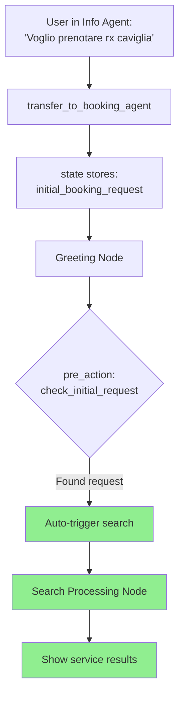
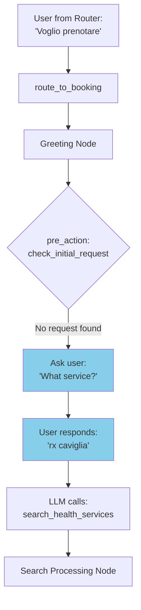

# Info → Booking Transfer Fix - Auto-Search Implementation

**Date:** 2025-01-17
**Issue:** User had to repeat service name after transferring from info to booking agent
**Status:** ✅ FIXED

---

## 🐛 **THE PROBLEM**

### **Before Fix:**
```
User in Info Agent: "Voglio prenotare rx caviglia destra"
   ↓
LLM calls: transfer_to_booking_agent(user_request="RX caviglia destra")
   ↓
Handler routes to → Greeting Node
   ↓
Greeting asks: "What service would you like to book?" ❌
   ↓
User has to repeat: "rx caviglia destra" 😞 BAD UX!
```

**Log evidence:**
```
'user_request': 'RX caviglia destra'  ← User already said it!
transfer_from_info_to_booking_handler: Transferring...
_execute_transition: Transition to greeting  ← Goes to greeting
Greeting node asks user again  ← Repetition!
```

---

## ✅ **THE SOLUTION**

### **After Fix:**
```
User in Info Agent: "Voglio prenotare rx caviglia destra"
   ↓
LLM calls: transfer_to_booking_agent(user_request="RX caviglia destra")
   ↓
Handler stores: state["initial_booking_request"] = "RX caviglia destra"
   ↓
Routes to → Greeting Node
   ↓
Greeting pre_action checks: initial_booking_request exists? YES!
   ↓
Auto-trigger search_health_services("RX caviglia destra") ✅
   ↓
Search starts immediately - NO repetition! 🎉
```

---

## 🔧 **CHANGES MADE**

### **File:** `flows/nodes/greeting.py`

**Added:**
1. **Pre-action function** `check_initial_request()` (lines 18-29)
   - Checks if `initial_booking_request` exists in flow_manager.state
   - If YES → Auto-triggers `search_health_services_and_transition()`
   - If NO → Returns None (normal flow continues)

2. **Pre-actions parameter** (line 62)
   ```python
   pre_actions=[check_initial_request]
   ```

**How it works:**
- `pre_actions` run BEFORE the node's main conversation
- If pre-action returns a tuple `(result, NodeConfig)`, it transitions immediately
- If pre-action returns `None`, normal conversation starts

---

## 📊 **FLOW COMPARISON**

### **Scenario 1: Transfer from Info Agent (NEW FIX)**



### **Scenario 2: Direct from Router (UNCHANGED)**



---

## 🧪 **TESTING**

### **Test Case 1: Info → Booking Transfer**
```bash
conda activate healthcare-agent
python chat_test.py
```

**Conversation:**
```
User: "Quanto costa una visita?"
Bot: [Answers with pricing info]

User: "Voglio prenotare rx caviglia destra"
Bot: "Sto cercando servizi correlati a RX caviglia destra. Attendi..."  ✅ NO REPETITION!
Bot: [Shows search results]
```

**Expected Logs:**
```
INFO: 🟠➜🟢 Transferring from INFO to BOOKING
INFO: 🎯 Auto-triggering search for: 'rx caviglia destra' (from info agent transfer)
INFO: 🔍 Flow searching health services: 'rx caviglia destra'
```

---

### **Test Case 2: Router → Booking (Normal Flow)**
```bash
python chat_test.py
```

**Conversation:**
```
User: "Vorrei prenotare"
Bot: "Hello, I'm Ualà. Can you tell me which service you would like to book?"  ✅ ASKS USER
User: "rx caviglia destra"
Bot: "Sto cercando servizi..."
Bot: [Shows search results]
```

**Expected Logs:**
```
INFO: Routing to BOOKING
DEBUG: pre_action: check_initial_request - No initial request found
INFO: Greeting node active
```

---

## 🔑 **KEY POINTS**

### **What `pre_actions` Does:**
```python
pre_actions=[check_initial_request]
```

1. **Runs BEFORE node starts** (before bot speaks)
2. **Checks flow_manager.state** for pre-filled data
3. **Can trigger immediate transitions** (skip node entirely)
4. **Returns `(result, NodeConfig)` OR `None`**

### **Why This Solution is Better:**

✅ **No code duplication** - Uses existing `search_health_services_and_transition`
✅ **Maintains compatibility** - Router → Booking still works normally
✅ **Clean state management** - Uses existing `initial_booking_request` pattern
✅ **Better UX** - No repetition when user already specified service
✅ **Safe** - Only triggers auto-search when request exists

---

## 📝 **STATE VARIABLES**

| Variable | Set By | Used By | Purpose |
|----------|--------|---------|---------|
| `initial_booking_request` | `transfer_from_info_to_booking_handler` | `check_initial_request` pre-action | Store user's service request during transfer |
| `pending_search_term` | `search_health_services_and_transition` | Search processing node | Store search query for processing |
| `pending_search_limit` | `search_health_services_and_transition` | Search processing node | Max results to return |

---

## 🚀 **DEPLOYMENT**

### **Files Changed:**
1. `flows/nodes/greeting.py` - Added auto-search pre-action
2. `info_agent/flows/nodes/greeting.py` - Added `transfer_to_booking_agent` function (from previous fix)

### **Dependencies:**
- No new dependencies required
- Uses existing `search_health_services_and_transition` handler
- Compatible with pipecat-flows pre_actions feature

### **Testing Checklist:**
- [ ] Info → Booking transfer (auto-search)
- [ ] Router → Booking (asks user)
- [ ] Booking → Info (after completion)
- [ ] Error handling if search fails

---

## 🐞 **TROUBLESHOOTING**

### **Issue:** Bot still asks "What service?" after transfer
**Solution:** Check logs for `initial_booking_request` in state:
```bash
docker-compose logs -f | grep "initial_booking_request"
```

### **Issue:** Search not triggered automatically
**Solution:** Verify pre-action is running:
```bash
docker-compose logs -f | grep "Auto-triggering search"
```

### **Issue:** State variable not found
**Solution:** Ensure handler sets it correctly:
```python
flow_manager.state["initial_booking_request"] = user_request
```

---

## 📚 **RELATED DOCUMENTATION**

- Main implementation: [UNIFIED_AGENT_CHANGES.md](UNIFIED_AGENT_CHANGES.md)
- Pipecat flows: `pre_actions` feature documentation
- Handler reference: `flows/handlers/agent_routing_handlers.py`

---

**Implementation Date:** 2025-01-17
**Status:** ✅ Fixed - Ready for Testing
**Next Steps:** Test locally → Deploy to production
