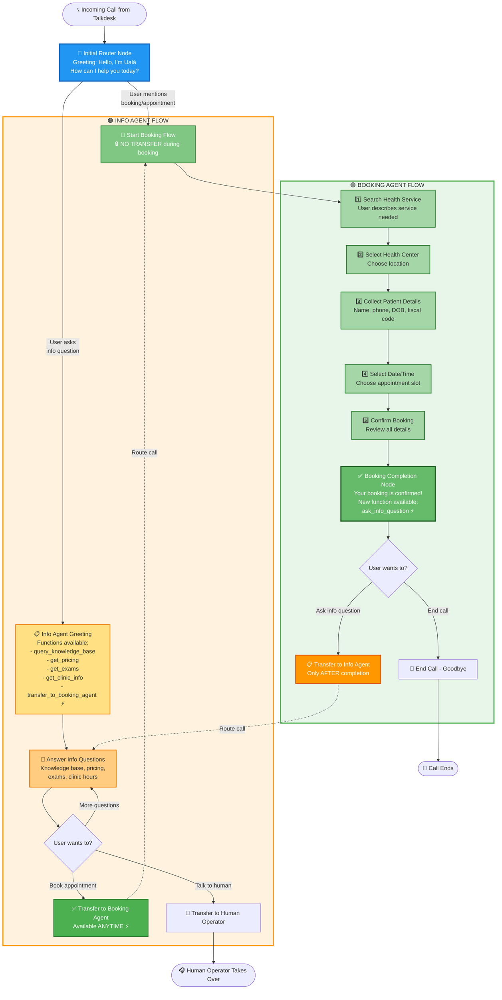
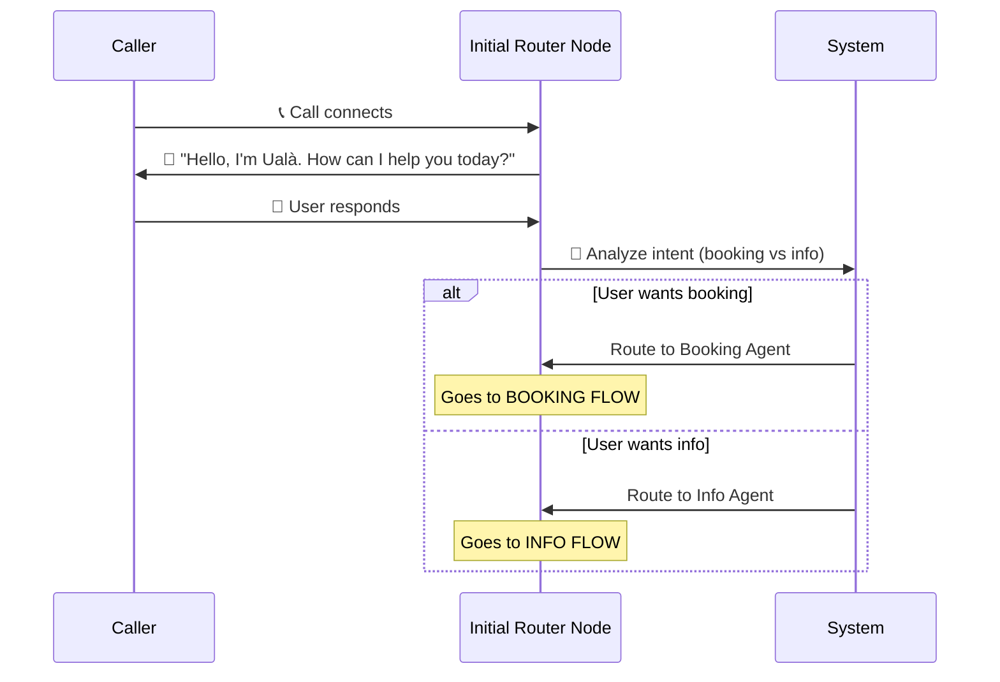
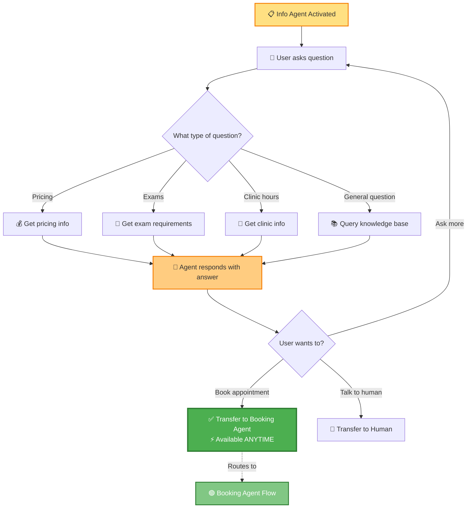
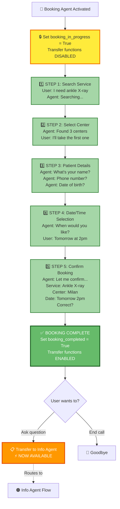
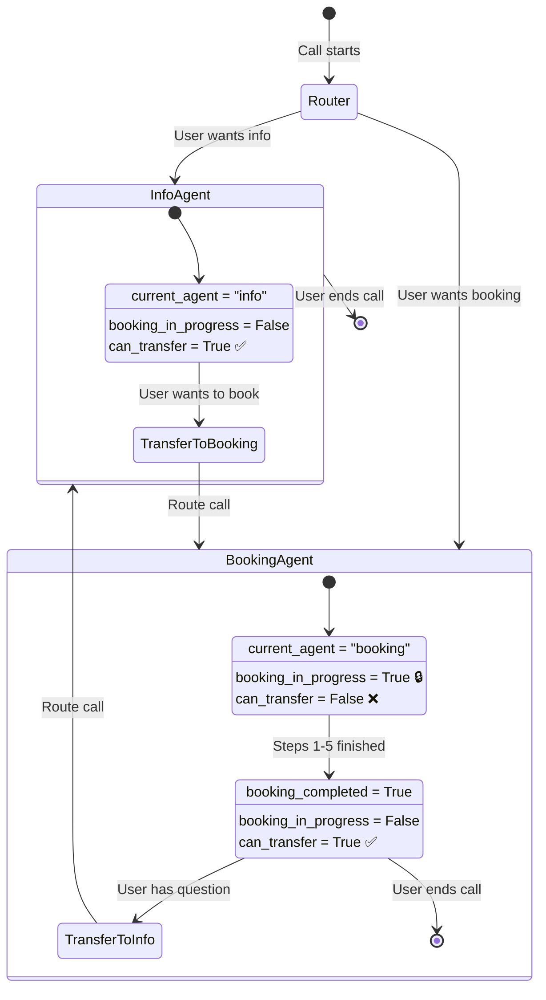

# Unified Agent Routing Flow - Step by Step

## Complete Flow Diagram



---

## Step-by-Step Explanation

### 🎬 **PHASE 1: Call Start & Initial Routing**



**Example Scenarios:**
- User says: *"I need to book an X-ray"* → **Booking Flow**
- User says: *"What are your opening hours?"* → **Info Flow**
- User says: *"How much does a blood test cost?"* → **Info Flow**

---

### 🟠 **PHASE 2: Info Agent Flow** (Stateless - Can Transfer Anytime)



**Key Rule:**
> ✅ **Info agent can transfer to booking ANYTIME**
> Why? Info queries are stateless - no booking in progress to protect

**Example Conversation:**
```
Agent: "Hello, I'm Ualà. How can I help?"
User: "What are your opening hours?"
Agent: [Provides info] "We're open 8am-6pm. Anything else?"
User: "I'd like to book an appointment"
Agent: ✅ [Transfers to booking agent] "Great, let me help you book..."
```

---

### 🟢 **PHASE 3: Booking Agent Flow** (Protected - No Transfers)



**Key Rules:**
> 🔒 **NO transfers during booking steps 1-5**
> Why? Must protect booking flow integrity - user must complete or abandon
>
> ✅ **Transfer to Info ONLY after booking complete**
> Why? User may have follow-up questions about their appointment

**Example Conversation:**
```
Agent: "Let me help you book an appointment"
[STEPS 1-5: Service → Center → Details → Date → Confirm]
Agent: "Your booking is confirmed!"
User: "What should I bring to the appointment?"
Agent: ✅ [Can now transfer to info] "Let me get that info for you..."
```

---

### 📊 **State Management Throughout the Flow**



---

## 🎯 **Key Rules Summary**

### ✅ **Info Agent Rules**
| Can Do | Cannot Do |
|--------|-----------|
| ✅ Answer questions anytime | ❌ Book appointments (transfers to booking) |
| ✅ Transfer to booking ANYTIME | |
| ✅ Transfer to human operator | |
| ✅ Handle multiple questions | |

### ✅ **Booking Agent Rules**
| Can Do | Cannot Do |
|--------|-----------|
| ✅ Complete booking (steps 1-5) | ❌ Transfer to info during booking (steps 1-5) |
| ✅ After completion: transfer to info | ❌ Interrupt booking flow |
| ✅ After completion: end call | |

---

## 🔄 **Transfer Scenarios**

### Scenario 1: Info → Booking (Always Allowed ✅)
```
User asks: "What's the price?"
→ Info Agent answers
→ User says: "I want to book"
→ ✅ Transfer immediately to Booking Agent
```

### Scenario 2: Booking → Info (Blocked during booking 🔒)
```
Booking Agent: "What's your phone number?"
User: "Wait, what are your hours?"
→ ❌ NO transfer (booking in progress)
→ Agent: "I can help with that after we finish booking"
```

### Scenario 3: Booking → Info (Allowed after completion ✅)
```
Booking Agent: "Your booking is confirmed!"
User: "What documents do I need?"
→ ✅ Transfer to Info Agent
→ Info Agent provides document info
```

---

## 🧪 **Testing Checklist**

- [ ] Initial routing detects booking intent correctly
- [ ] Initial routing detects info intent correctly
- [ ] Info agent can transfer to booking anytime
- [ ] Booking agent CANNOT transfer during steps 1-5
- [ ] Booking agent CAN transfer after completion
- [ ] State preservation works across transfers
- [ ] User can return to info agent from booking completion

---

## 📁 **Files to Create/Modify**

### New Files:
1. `flows/nodes/router.py` - Initial routing node
2. `flows/handlers/agent_routing_handlers.py` - Routing logic

### Modified Files:
1. `info_agent/flows/nodes/greeting.py` - Add booking transfer
2. `flows/nodes/completion.py` - Add info transfer
3. `bot.py` - Use router as entry point
4. `flows/manager.py` - Add router start node

